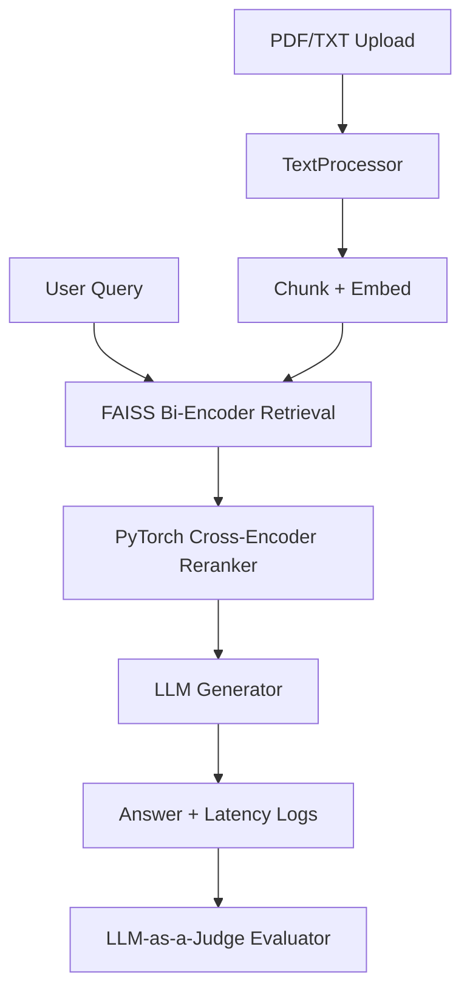

# Implementation Plan — Enterprise RAG System

This document is the authoritative design spec for the project. Code lives under `src/` as described below.

## Overview

Enterprise-grade RAG with:

- Custom **PyTorch Cross-Encoder reranker**
- **LLM-as-a-judge** evaluation metrics
- **Latency / experiment tracking** (MLflow or TensorBoard)
- **Containerized** FastAPI + Streamlit services

## Architecture



## Requirements

| Item | Details |
|------|---------|
| **LLM backends** | **Qwen** (DashScope API), Ollama (local Qwen), mock |
| **API keys** | `DASHSCOPE_API_KEY` or `QWEN_API_KEY` in `.env` |
| **Reranker base** | `distilbert-base-uncased` or `cross-encoder/ms-marco-MiniLM-L-6-v2` |
| **Embeddings** | `sentence-transformers/all-MiniLM-L6-v2` or `all-mpnet-base-v2` |
| **Tracking** | MLflow (default) or TensorBoard → local dirs, configurable for remote |

## Module Structure

```
PyTorch/
├── src/
│   ├── config.py
│   ├── pipeline.py
│   ├── reranker/          # model.py, dataset.py, train.py
│   ├── retriever/         # text_processor.py, vector_store.py
│   ├── generator/         # llm_client.py
│   ├── evaluator/         # metrics.py
│   └── app/               # main.py, dashboard.py
├── tests/
├── Dockerfile
├── docker-compose.yml
├── requirements.txt
└── run.py
```

## Specifications

### 1. PyTorch Neural Reranker (`src/reranker/model.py`)

Cross-encoder feeds query + document together into a transformer; outputs a relevance score.

- `NeuralReranker(nn.Module)` with `AutoModel` + `nn.Linear` classifier
- Pre-trained cross-encoders use `AutoModelForSequenceClassification` when model name contains `cross-encoder`

### 2. Training (`src/reranker/train.py`)

- Loss: **BCEWithLogitsLoss** (default) or **Margin MSE** (`RERANKER_LOSS=margin_mse`)
- Mixed precision: `torch.amp.autocast` + `GradScaler` on CUDA
- Optimizer: AdamW + cosine LR schedule
- Metrics: loss, **accuracy**, MRR@K, NDCG@K
- Tracking: MLflow or TensorBoard

### 3. FAISS Retriever (`src/retriever/`)

- PDF/text extraction, chunk metadata (source, page, chunk ID)
- SentenceTransformer embeddings
- FAISS `IndexFlatL2` or `IndexIVFFlat` (`FAISS_USE_IVF=true`)

### 4. Evaluator (`src/evaluator/metrics.py`)

LLM-as-a-judge via JSON prompts:

- Context Precision
- Answer Faithfulness
- Answer Relevance

### 5. FastAPI (`src/app/main.py`)

| Endpoint | Description |
|----------|-------------|
| `POST /ingest` | Multi-file PDF/TXT upload → FAISS |
| `POST /query` | Retrieve → rerank → generate (optional `stream=true`) |
| `POST /query/stream` | SSE streaming response |
| `GET /eval-report` | Aggregated eval benchmarks |
| `GET /stats` | Latency telemetry |

### 6. Streamlit Dashboard (`src/app/dashboard.py`)

- Document Manager (drag & drop PDF)
- RAG Comparison Lab (with vs without reranking + score table)
- Live Latency & Evaluation Radar (Plotly)

## Verification

```powershell
pytest tests/
python run.py api          # Terminal 1
python run.py dashboard    # Terminal 2
python run.py train        # Optional reranker training
```

Manual: upload a technical PDF, run queries, inspect reranking scores, check MLflow logs at `./data/mlruns`.

## Status

| Component | Status |
|-----------|--------|
| Reranker model + inference | Done |
| Training (BCE + Margin MSE, AMP, MRR/NDCG) | Done |
| FAISS retriever | Done |
| LLM generator (Gemini/OpenAI/Ollama/mock) | Done |
| LLM-as-a-judge evaluator | Done |
| FastAPI endpoints | Done |
| Streamlit dashboard | Done |
| Docker / docker-compose | Done |
| Tests (13 passing) | Done |
